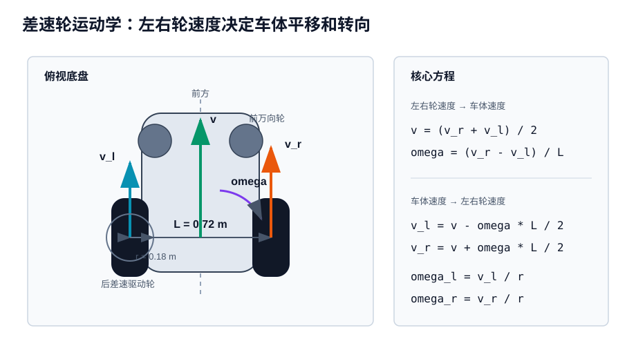
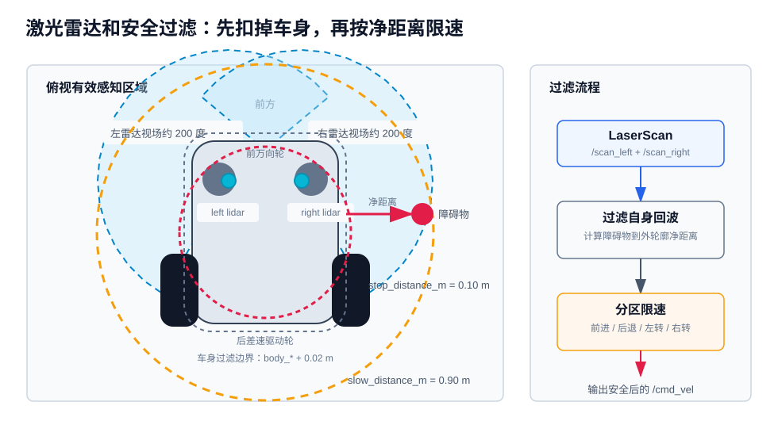

# SmartWheelChair ROS 仿真

这是一个基于 Docker 的 ROS Noetic + Gazebo 11（Classic）智能轮椅仿真环境，模型参考 M6 类智能轮椅结构。

## 仿真内容

- 后轮差速驱动，两侧后轮独立动力输出。
- 两个被动前万向轮。
- 左右两颗 360 度旋转单线激光雷达保留原始 2D 扫描；感知、规划与最终安全检查统一使用每侧约 200° 视场，并剔除车体内部回波。
- 后方中部 120 度广角摄像头。
- 统一共享控制器，根据激光数据进行延墙、窄门辅助、舒适限速和独立制动检查。
- 浏览器虚拟摇杆和后摄画面，倒车时叠加 2 米左右轮预测轨迹。

当前版本刻意不实现真实 GD32/RK3568 通信协议、SLAM、自主导航和认证级安全控制。

## 方案文档

- [当前方案架构与算法详解](docs/architecture-and-algorithms.md)：含系统架构、控制流程、沿墙几何、窄门通过和制动检查五张配图，以及算法参数、源码链接与复测说明。
- [门洞候选与绿色显示验证](docs/testing/2026-09-11-supported-door-detection.md)：现场卡门复现、检测修复、Gazebo 显示及闭环测试记录。

## 构建 Docker 镜像

Dockerfile 默认使用 DaoCloud 的 ARM64 `noetic-ros-base-focal` 镜像，Ubuntu Focal 软件包使用清华源，ROS 使用基础镜像自带的软件源。`docker-compose.yml` 针对 Apple Silicon Mac 固定为 `linux/arm64`；GUI 使用 Xvfb 与软件 OpenGL。

如果使用 macOS Docker Desktop，可以在 `Settings -> Docker Engine` 中加入下面配置，然后重启 Docker：

```json
{
  "registry-mirrors": [
    "https://docker.m.daocloud.io"
  ]
}
```

同样的配置也保存了一份在 `docker/daemon-cn-mirror.json`。

```bash
docker compose build
```

如果想绕过镜像源：

```bash
docker compose build --build-arg BASE_IMAGE=ros:noetic-ros-base-focal
```

## 打开 ROS Shell

```bash
docker compose run --rm sim
```

进入容器后执行：

```bash
cd /workspaces/SmartWheelChair/catkin_ws
catkin_make
source devel/setup.bash
```

## 启动仿真

在 Docker shell 内启动无界面 Gazebo：

```bash
LIBGL_ALWAYS_SOFTWARE=1 xvfb-run -a roslaunch smart_wheelchair_gazebo sim.launch
```

launch 默认只启动 Gazebo server；Xvfb 为相机提供虚拟显示器，不需要转发主机显示。

在 macOS 上显示 Gazebo 窗口，推荐使用浏览器 VNC 方案：

```bash
# 在仓库根目录运行
docker compose up -d gui
```

然后打开：

```text
http://localhost:6080/vnc.html
```

点击 `Connect`。VNC 方案会在容器桌面里运行 Gazebo，并使用软件 OpenGL。如果浏览器标签页来自旧的失败运行，请重新连接或强制刷新页面。

GUI 软件渲染默认设置 `LP_NUM_THREADS=2`，避免 llvmpipe 占满 Docker CPU 后拖慢 ROS 回调。不会降低激光雷达或摄像头的发布频率。

`docker compose up gui` 会通过 `docker/gazebo-gui-vnc.sh` 启动：

```bash
roslaunch smart_wheelchair_gazebo sim.launch gui:=true
```

`docker compose run --rm sim` 只会打开 ROS shell，不会自动启动 Gazebo。

## M6 地图布局

`m6_room` 保留 `16 × 12 m` 场地、木地板和原出生点，内部改为十字长通道与四个测试区：

- 横向、纵向主通道净宽均为 `2.58 m`，交叉口不设障碍；横向可直行跨越 `13.4 m`，纵向可直行跨越 `9.4 m`，两端留有掉头空间。
- 西北、东南区各有两个入口，可形成循环路线；东北、西南区各有一个入口，区内可掉头返回。
- 六个门均为真实碰撞墙体之间的净空，不用视觉缝隙代替门洞。门前可先对正，过门后有整车转向空间。

| 门洞 | 中心坐标 `(x, y)`，米 | 净宽 | 通行方向 |
| --- | --- | --- | --- |
| 西北区南门 | `(-4.5, 1.35)` | `1.0 m` | 南北 |
| 东北区南门 | `(4.5, 1.35)` | `1.1 m` | 南北 |
| 西南区北门 | `(-4.5, -1.35)` | `1.2 m` | 南北 |
| 东南区北门 | `(4.5, -1.35)` | `1.0 m` | 南北 |
| 西北区东门 | `(-1.35, 3.5)` | `1.1 m` | 东西 |
| 东南区西门 | `(1.35, -3.5)` | `1.2 m` | 东西 |

几何回归测试从出生点到主通道、每个门和房间构造连续可行路线，使用整车矩形轮廓附加 `6 cm` 检查裕量，覆盖双向通过和原地转向。出生点靠西墙，应先向前驶入通道再大角度掉头。几何可通行不等同于当前辅助控制器在任意斜向接近时都能自动、平顺通过窄门。

## 虚拟摇杆和后摄画面

在另一个浏览器标签页打开：

```text
http://localhost:8090
```

用鼠标或触控板拖动摇杆，会发布 `/cmd_vel_raw`。松开摇杆或关闭页面后，运动指令会自动归零。

摇杆原始指令范围（最终输出还会经过控制器限速）：

- 前进最大速度：`6 kph`，即 `1.6666667 m/s`
- 后退最大速度：`3 kph`，即 `0.8333333 m/s`
- 最大角速度：`1.4 rad/s`

辅助模式默认前进上限为 `0.8 m/s`、倒车上限为 `0.4 m/s`、角速度上限为 `0.65 rad/s`；门洞对正限速 `0.35 m/s`，通过及车尾清空限速 `0.55 m/s`。正常加减速进行平滑处理，松杆、数据失效和紧急制动优先于舒适性限制。页面切换到手动模式后，新鲜输入直接透传，绕过辅助限速与制动检查；切换模式需要先回中。

后方 120 度广角摄像头画面显示在同一个浏览器控制页中。倒车时，画面会根据差速轮运动学叠加 2 米范围内的左右轮预测轨迹。

## 差速轮运动学方程



仿真底盘使用后轮差速驱动，Gazebo 模型参数为：

- 驱动轮距 `L = 0.72 m`
- 车轮半径 `r = 0.18 m`
- 车体线速度 `v = linear.x`
- 车体角速度 `omega = angular.z`
- 左右轮线速度分别为 `v_l`、`v_r`
- 左右轮角速度分别为 `omega_l`、`omega_r`

由左右轮速度得到车体速度：

```text
v     = (v_r + v_l) / 2
omega = (v_r - v_l) / L
```

由车体速度反算左右轮速度：

```text
v_l = v - omega * L / 2
v_r = v + omega * L / 2

omega_l = v_l / r
omega_r = v_r / r
```

在平面位姿 `(x, y, theta)` 下，后轴中心的运动方程为：

```text
dx/dt     = v * cos(theta)
dy/dt     = v * sin(theta)
dtheta/dt = omega
```

后摄倒车轨迹使用曲率积分，曲率 `k = omega / v`。当 `omega = 0` 时轨迹为直线；否则沿圆弧预测：

```text
theta_s = k * s
x_s     = sin(theta_s) / k
y_s     = (1 - cos(theta_s)) / k
```

其中 `s` 是沿车体前后方向的预测距离，倒车时 `s < 0`。左右轮轨迹是在后轴中心轨迹基础上叠加横向偏移 `+/- L/2`。`/odom` 来自 Gazebo P3D 对后轴 link 的测量，经 relay 将与 `world` 重合的父坐标系标记为 `odom`；差速插件发布的模型原点 `/diff_drive/odom` 仅供诊断。

## 激光雷达和安全过滤



两颗激光雷达原始话题仍为完整 360°：每侧 721 束，角分辨率 0.5°，10 Hz。感知、规划与最终安全检查统一采用左侧 −30°～170°、右侧 −170°～30°（各 401 个角度采样），剔除采集时车体内部回波，仅保留有效且不超过 4.5 m 的障碍点。`/unified_scan_*` 保持原消息角度布局，将排除点置为 `+inf`，路径跟随器和最终检查使用相同的自体过滤结果。扫描健康检查也只统计选定区域；原始话题不变。Gazebo 同步显示选定角域并保留外观遮挡裁剪。ROS 输出是 `LaserScan` 话题，不是 3D 点云：

两颗雷达及外壳现位于 `base_link` 的 `(0.46, ±0.36, 0.56) m`，各向外移 10 cm，外壳保持在既有 0.8 m 车宽内；平面控制相对后轴外参为 `(0.79, ±0.36) m`。三维几何回归同时检查外观与碰撞几何，确认所选角域避开当前空载模型的车身结构（排除雷达自身外壳），不是靠删掉被挡射线伪造连续视场。外参和角域集中在 `unified_geometry.py`，供 TF、自体过滤、跟随器和诊断脚本共用。

**限制：两侧角域合并后，正后方约 20° 没有当前雷达检查覆盖。排除点不表示已证实空旷，本配置不能保证盲区内的倒车或原地转向安全。乘员、附件及实车装配不在空载模型无遮挡验证范围内。已有门框记忆不能替代通用盲区检测；旧安装位置或 360° 安全输入下的验收结果不自动适用于此配置。**

```bash
rostopic echo /scan_left
rostopic echo /scan_right
```

统一控制器把雷达测距转换为车身坐标系障碍点，并以整车矩形轮廓、制动距离和额外安全裕量进行碰撞检查。距离小于车身过滤边界的自身回波会在进入控制逻辑前剔除。

如果已经停在 4 cm 安全余量内，辅助控制允许按摇杆低速离开（最高 0.05 m/s、0.1 rad/s），避免所有方向被初始余量违反一并锁死。恢复检查比较完整制动轨迹与立即停车轨迹的逐点有符号距离；主动向障碍挤压仍会被拒绝。对紧邻边界、停车检查本来已失败的点，也允许满足严格改善条件的名义退离，不代表恢复完整鲁棒保证。恢复到 6 cm 后，倒车/转向可交回常规控制；前向辅助须等正常控制有可执行指令再交接，避免再次落入不可行门路径。松杆、扫描或里程计过期仍停车。这是仿真低速模型下的恢复策略，不是实车接触脱困或安全认证。

同时贴两面墙且浅角度离开时仍可能低速、断续移动，并非任何方向都能安全通过。现场根因、测试矩阵及已知边界见 [近障碍锁死修复与验收](docs/testing/2026-09-11-clearance-recovery.md)。

## 统一共享控制 V1

控制链路为：摇杆意图 → 墙线/门洞参考路径 → ROS1 局部路径跟踪器 → 速度平滑 → 独立制动检查 → `/cmd_vel`。跟踪器每周期枚举 `9 × 15` 组恒定线速度/角速度，预测 `1 s`，步长 `0.1 s`，以整车矩形净空和路径评分选择候选。门洞使用专用路径跟踪与安全速度搜索；最终协调器仍检查实测动量、反应延迟和制动尾段。

- 斜向靠墙与平行沿墙共用切向参考，稳定沿墙的车身边沿目标净距为 `12 cm`（`wall_clearance=0.12`），按 `15 cm` 内进行跟随验证，不是后轴中心到墙的距离。接近墙、门洞和转角阶段允许留出更多安全空间；反向转向输入可以退出沿墙接管。
- 沿墙遇到宽度不小于 `1.8 m` 的同侧通道时，只有用户持续向开口侧转向才会锁存开口；控制器先保持原航向越过近端墙角，再生成进入通道的切向路径。摇杆保持直行不会被开口吸入。窄于该阈值的开口不走直接转弯逻辑。
- 沿墙判断使用实际有限墙段：车尾越过近端墙角、且摇杆轨迹不接近真实墙段时，恢复摇杆参考，路口另一端的共线墙不会被当成路口中间仍有墙。
- 正前方横墙仍停车，不自动替用户选择左转或右转。停车状态保持到松杆、倒车或原地转向；正常停车目标净距为约 `12 cm`。
- 一期门洞辅助识别前方近似共面的两侧门框，剔除间隙内仍存在墙面支撑的假门洞，并用摇杆未来 `3 s` 轨迹区分过窄门和延墙意图。轨迹指向门洞时优先按 `door_align → door_pass → door_clear` 对正通过，主动朝门洞转向不会被当成取消；松杆、倒车或持续 `0.35 s` 明显转离门洞仍可退出辅助。意图走廊只用于模式选择，不放宽门宽、整车轮廓或制动净空。
- 确认门洞后先在 `door_wait` 状态减速等待实测停稳与可行路径。直接对正曲线不可行时，可在已检查整车旋转扫掠的门前空间转向、低速移动到门中心线，再对正通过。没有可行空间就停住；不自动倒车。短暂传感器失效仍立即停车，但保留锁定路径最多 `1 s`，避免一次数据间断丢掉正在执行的对正动作。
- 两侧扫描、里程计、摇杆或规划输出失效时停车。有效的正无穷雷达回波表示量程内空旷，不当作断线。
- Gazebo 两颗激光雷达当前量程均为 `5.0 m`；硬件雷达标称最远 `12 m`，待实车标定后再单独调整，不能直接套用仿真参数。
- 几何统一到后轴中心：车身 `x=[-0.25, 0.97] m`、`y=[-0.40, 0.40] m`。硬检查附加 `4 cm` 裕量与受减速度约束的制动尾段；这不是实车安全保证。

Gazebo C++ 插件用两套三线轨迹分别显示原始摇杆指令和最终 `/cmd_vel` 的恒曲率预测（`3 s`）；它们不代表已经通过净空验证的路径。

检测到并经连续观测确认的窄门以**绿色线段**连接两侧门框；摇杆回中时仍显示，观测消失或过期时清除。绿色表示检测结果，不代表已验证可通行。线段固定在世界坐标中，仅供 GUI 显示，不参与碰撞、雷达或相机感知。对应 `/shared_control/door_detections` 为 `geometry_msgs/PolygonStamped`，`odom` 坐标系，每两个点是一条门洞线段。

参考路径与控制状态可查看：

```bash
rostopic echo /shared_control/status
rostopic echo /shared_control/reference
rostopic echo /cmd_vel_planned
```

独立一米门洞测试场景（启动位置偏角约 10 度、横向偏置 15 cm）：

```bash
WHEELCHAIR_WORLD=/workspaces/SmartWheelChair/catkin_ws/src/smart_wheelchair_gazebo/worlds/unified_door.world docker compose up -d gui
```

恢复原场景：`docker compose up -d gui`。门洞辅助目前仅针对静态、平面、可观测的室内场景，不包含动态行人预测、台阶/悬空检测和自动倒车脱困。实车还需要验证遮挡、打滑、定位误差、执行延迟与真实制动能力。实现说明与复测方法见 [当前方案架构与算法详解](docs/architecture-and-algorithms.md)。

## 键盘遥控

GUI 运行时，在主机另一终端进入同一个容器进行键盘遥控，指令经过统一控制器：

```bash
docker compose exec gui bash -lc 'source /opt/ros/noetic/setup.bash && source catkin_ws/devel/setup.bash && rosrun teleop_twist_keyboard teleop_twist_keyboard.py cmd_vel:=cmd_vel_raw'
```

常用话题：

```bash
rostopic list
rostopic echo /scan_left
rostopic echo /scan_right
rostopic echo /odom
```

默认地图以全图俯视视角打开。左侧原生雷达扫描区域为青蓝色，右侧为紫色，使用 `8%` 不透明度；已移除模型中十条装饰性绿色雷达射线，保留检测门洞的绿色线段。轮椅外观使用 `35%` 透明度（后摄图像中也会呈现此材质）。GUI 扫描按激光高度与当前车身 box 外观的交点截断，排除自身雷达外壳；不修改 ROS 雷达数据、碰撞体或控制逻辑。

注意：安全控制中的自体回波过滤不等于完整的车身遮挡/盲区模型。当前 Gazebo ray 传感器使用碰撞几何，部分车身细节仅有外观；GUI 裁剪不能作为实际感知覆盖或盲区安全性的证明。

## 测试与闭环复测

主机需 Python 与 NumPy；无 ROS 时节点测试会跳过，完整测试应在容器执行：

```bash
PYTHONPATH=catkin_ws/src/smart_wheelchair_safety python3 -m unittest discover -s catkin_ws/src/smart_wheelchair_safety/test -v
PYTHONPATH=catkin_ws/src/smart_wheelchair_safety python3 -m unittest discover -s catkin_ws/src/smart_wheelchair_gazebo/test -v
docker compose stop gui
docker compose build sim
docker compose run --rm sim bash -lc 'cd catkin_ws && catkin_make && source devel/setup.bash && catkin_make run_tests && catkin_test_results --verbose'
```

启动独立无界面运行实例：

```bash
docker compose run -d --name smart-wheelchair-verify sim bash -lc 'source catkin_ws/devel/setup.bash && LIBGL_ALWAYS_SOFTWARE=1 xvfb-run -a roslaunch smart_wheelchair_gazebo sim.launch gui:=false; exit $?'
docker exec smart-wheelchair-verify bash -lc 'source /opt/ros/noetic/setup.bash; source catkin_ws/devel/setup.bash; rostopic list'
docker exec smart-wheelchair-verify bash -lc 'source /opt/ros/noetic/setup.bash; source catkin_ws/devel/setup.bash; python3 scripts/probe_unified_control.py front --output /tmp/front.json'
docker exec smart-wheelchair-verify pkill -INT -x roslaunch
docker stop --time 60 smart-wheelchair-verify
docker rm smart-wheelchair-verify
```

等到 `/clock`、`/odom`、双侧扫描和 HTTP `8090` 就绪后再执行探针。将 `front` 换为 `wall` 可验证沿墙；每个用例都重新启动实例。门洞用例需在 roslaunch 命令中加 `world:=/workspaces/SmartWheelChair/catkin_ws/src/smart_wheelchair_gazebo/worlds/unified_door.world`，再执行 `probe_unified_control.py door`。每例默认运动 30 秒，结束后验证指令与实测速度都停止；报告含净距、速度和模式顺序。探针会实际移动车辆，仅用于仿真，运行时关闭其他摇杆页面。

全地图门洞矩阵在已启动 `m6_room` 的专用容器内执行（会重启协调器与局部跟踪节点）：

```bash
python3 catkin_ws/src/smart_wheelchair_gazebo/test/check_door_matrix.py --output /tmp/door-matrix
```

默认覆盖 6 门、双向、`0°/±15°/±30°/±45°` 共 84 例，每例限时 `35 s`。判定依据为实际里程计的整车轮廓相对地图碰撞体保留 `2 cm`、穿过指定门洞、车尾完整过门和松杆后的新鲜停车数据；超时或连续静止超过 `3 s` 也计入失败。保存逐例轨迹、汇总及源码 SHA-256，源码中途变化会中止，未完成的批次不能作为全矩阵通过率。可用 `--doors` 分组；建议顺序执行，避免多个 Gazebo 实例争抢 CPU 导致传感数据过期停车。

可补充 `--lateral-offset 0.25 --angles -15 0 15` 和 `--lateral-offset -0.25 --angles -15 0 15`，测试前推杆射线偏离门洞中心 25 cm 的起点；每轮使用独立输出目录，不能用复查结果覆盖原失败。

路口矩阵覆盖四个来向的提前左右转、保持直行和进入开口后左右转，共 20 例；以下使用最大前推输入，实际辅助速度仍限于 `0.8 m/s`：

```bash
python3 catkin_ws/src/smart_wheelchair_gazebo/test/check_junction_matrix.py --forward-y 1.0 --output .superpowers/behavior/junction-matrix
```

测试口径、复现步骤与结果见[窄门及路口验证记录](docs/verification/2026-09-11-door-and-junction.md)。

原生渲染检查需要独立 ROS master 和 Xvfb，检查固定轨迹槽位、显隐循环、激光稳定性及摄像头帧：

```bash
docker compose run --rm sim roscore
```

上面的 shell 保持运行，在另一个终端执行：

```bash
docker compose run --rm sim bash -lc 'source /usr/share/gazebo/setup.sh && source catkin_ws/devel/setup.bash && LIBGL_ALWAYS_SOFTWARE=1 xvfb-run -a python3 catkin_ws/src/smart_wheelchair_gazebo/test/check_trajectory_preview.py; exit $?'
```

结束后用 Ctrl-C 停止独立 master，再执行 `docker compose down`。`xvfb-run` 后保留 `exit $?`，避免它成为容器 PID 1 后无法收到 Xvfb 的就绪信号。不要同时运行 GUI、headless 场景或另一个使用相同 ROS/Gazebo 端口的实例。构建产生的 `catkin_ws/build`、`devel`、`.catkin_workspace` 与顶层 catkin CMake 链接均不应提交。

此固定仿真栈的 catkin 配置会输出 `WARNING: package 'gazebo_ros' is deprecated`、`WARNING: package 'gazebo_msgs' is deprecated`，并包含 `Gazebo classic 11 reaching end-of-life` 说明。这些是依赖包声明的生命周期警告；验证以构建退出码、完整测试结果、传感器数据和闭环行为为准，不宣称整套工具输出完全无警告。Dockerfile 的平台由 Compose 指定，不再重复写入 `FROM`，构建检查不应出现平台冗余警告。

探针松杆后只接受新的 `/cmd_vel` 与里程计样本：两个接收时间都必须晚于本次零指令请求完成，且在判断时均不超过 `0.25 s`。结果保存 `released`、`settled_at` 和两路接收时间，旧的缓存零值不能证明停车。

## 拆机信息对应关系

当前模型根据拆机总结做了以下抽象：

- 前轮是被动万向轮。
- 后轮独立驱动，组成差速底盘。
- 两颗雷达的原始扫描保持 360°，感知、规划和最终检查统一使用每侧约 200°、经过自体回波过滤的输入，正后方未覆盖区域不参与当前点云检查。
- 后摄像头建模为 120 度广角视频传感器。
- 仿真实现沿墙、门洞和制动辅助等局部共享控制，不执行目标点导航。
