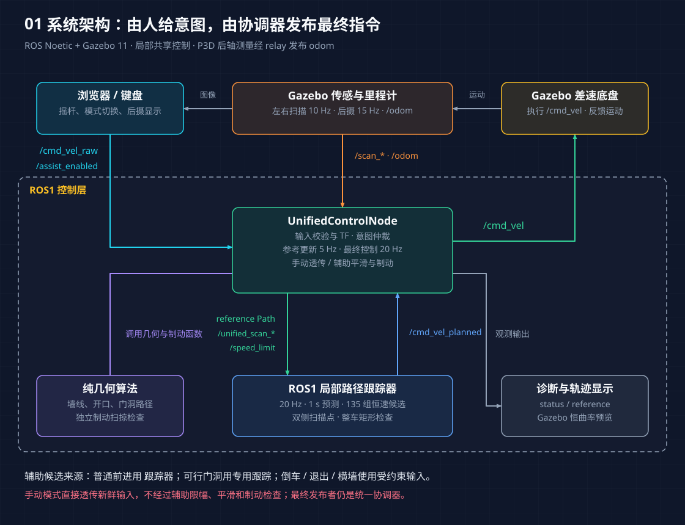
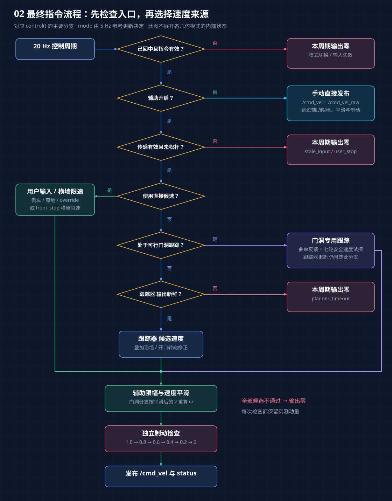
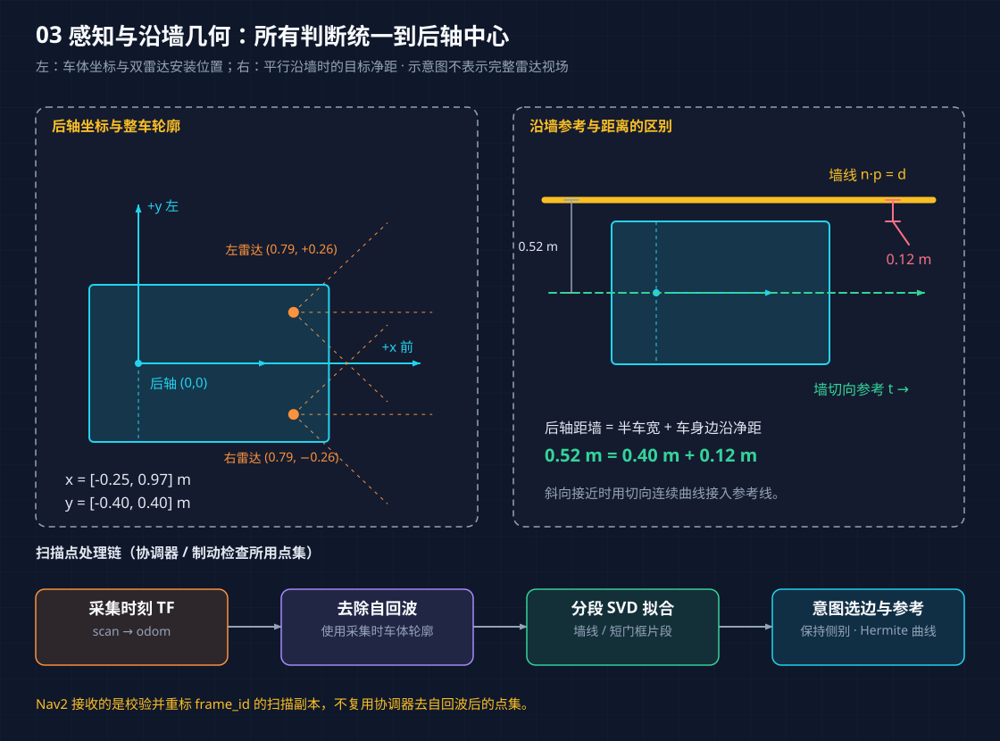
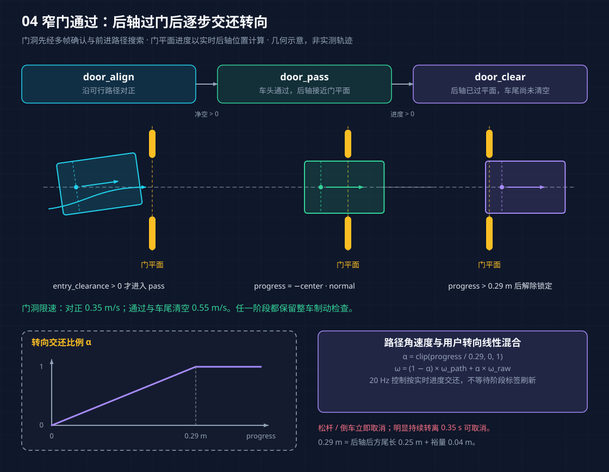
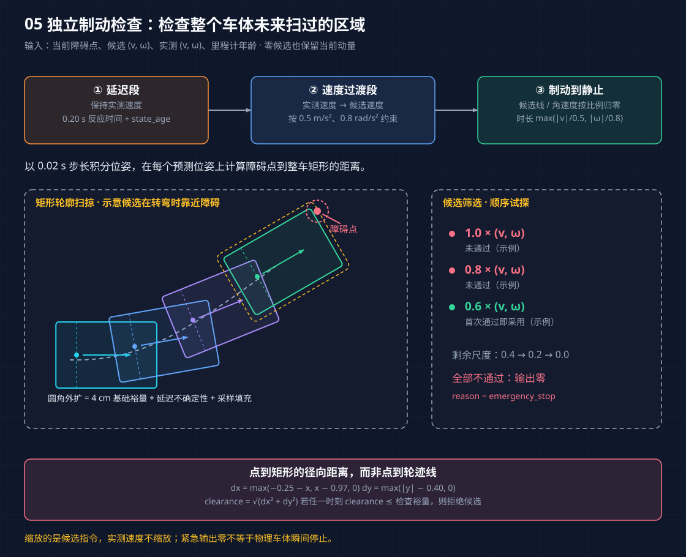

# 当前方案架构与算法详解

本文依据 2026-09-10 当前工作区中的实现编写，说明智能轮椅 ROS 2 仿真的组成、控制分支、算法与参数。参数以文中链接的源码和配置为准，启动方法见 [README](../README.md)。文中新增五张示意图使用 baoyu-diagram 风格绘制，分别提供可缩放 SVG 和 2 倍分辨率 PNG。

阅读导航：

1. [方案定位与整体结构](#1-方案定位与整体结构)
2. [ROS 接口与坐标系](#2-ros-接口与坐标系)
3. [雷达预处理与有效性判断](#3-雷达预处理与有效性判断)
4. [墙线提取与开口识别](#4-墙线提取与开口识别)
5. [意图仲裁与状态机](#5-意图仲裁与状态机)
6. [沿墙与宽开口转弯](#6-沿墙与宽开口转弯)
7. [窄门路径搜索与专用跟踪](#7-窄门路径搜索与专用跟踪)
8. [Nav2 MPPI 与局部代价地图](#8-nav2-mppi-与局部代价地图)
9. [速度平滑、正面停车与独立制动检查](#9-速度平滑正面停车与独立制动检查)
10. [浏览器交互与可视化](#10-浏览器交互与可视化)
11. [阅读源码与验证方案](#11-阅读源码与验证方案)
12. [当前边界与修改时的耦合项](#12-当前边界与修改时的耦合项)

## 1. 方案定位与整体结构

系统实现由人持续操作摇杆的局部共享控制：用户决定前进、后退和转向，辅助控制器利用两侧激光扫描识别墙线与开口，生成局部参考路径，调整速度和转向，并检查整车制动扫掠区域。系统没有目标点任务、全局地图、SLAM 或自主导航任务管理。



图 1：当前运行模块与主要数据流。统一协调器拥有最终指令发布权；各辅助分支的候选速度来源见图 2。[查看 SVG](diagram/01-system-architecture.svg) · [下载高清 PNG](diagram/01-system-architecture@2x.png)。

当前存在两个用户可选模式，默认开启辅助：

| 用户模式 | 指令处理 | 对传感器和规划器的依赖 |
| --- | --- | --- |
| 辅助模式 | 意图判断、参考路径、局部规划或专用跟踪、速度平滑、独立制动检查 | 需要新鲜摇杆、里程计和两侧扫描；通常还需要新鲜 MPPI 输出，可行门洞路径是例外 |
| 手动模式 | 将新鲜、有限值的 `/cmd_vel_raw` 直接发布到 `/cmd_vel` | 只保留指令超时与模式切换回中约束，不要求扫描、里程计或 MPPI 有效 |

**手动模式绕过避障、沿墙、过门、辅助速度上限、舒适性限制和制动检查。** 状态名称中的 `manual` 另有含义：它是辅助模式下的普通摇杆参考状态，仍受辅助控制链约束；真正的用户手动模式状态名为 `manual_direct`。

### 1.1 模块职责

| 模块 | 职责 | 实现入口 |
| --- | --- | --- |
| Docker 与桌面环境 | ROS 2 Jazzy、Gazebo、Nav2、VNC/noVNC 运行环境 | [Dockerfile](../docker/Dockerfile)、[Compose](../docker-compose.yml) |
| 仿真启动 | 启动 Gazebo、ROS/Gazebo 桥、控制节点与生命周期管理器 | [sim.launch.py](../ros2_ws/src/smart_wheelchair_gazebo/launch/sim.launch.py) |
| 轮椅与环境 | 后轮差速底盘、被动前轮、雷达、后摄和碰撞场景 | [model.sdf](../ros2_ws/src/smart_wheelchair_gazebo/models/smart_wheelchair/model.sdf)、[m6_room.sdf](../ros2_ws/src/smart_wheelchair_gazebo/worlds/m6_room.sdf) |
| Web 输入与显示 | HTTP 摇杆、手动/辅助切换、后摄画面、倒车轨迹 | [web_joystick_node.py](../ros2_ws/src/smart_wheelchair_safety/smart_wheelchair_safety/web_joystick_node.py)、[joystick.py](../ros2_ws/src/smart_wheelchair_safety/smart_wheelchair_safety/joystick.py) |
| 统一协调器 | 数据有效性、TF、意图仲裁、参考路径、动作请求、最终速度与状态发布 | [unified_control_node.py](../ros2_ws/src/smart_wheelchair_safety/smart_wheelchair_safety/unified_control_node.py) |
| 纯几何算法 | 分段墙线、开口识别、路径生成、门洞搜索、整车制动检查 | [unified_geometry.py](../ros2_ws/src/smart_wheelchair_safety/smart_wheelchair_safety/unified_geometry.py) |
| Nav2 局部规划 | MPPI 预测控制、滚动代价地图、FollowPath 动作 | [unified_control.yaml](../ros2_ws/src/smart_wheelchair_gazebo/config/unified_control.yaml) |
| Gazebo 轨迹显示 | 显示原始指令和最终指令各自的恒曲率三线预测 | [trajectory_preview_system.cc](../ros2_ws/src/smart_wheelchair_gazebo/src/trajectory_preview_system.cc) |

### 1.2 实际控制数据流



图 2：按最终输出逻辑展开主要分支。手动透传直接结束本周期；辅助模式中的门洞专用跟踪可绕过 MPPI 超时，但仍须经过制动检查。图中的“输入有效”包括原始指令新鲜且为有限值，“传感有效”包括两侧扫描和里程计通过检查。[查看 SVG](diagram/02-command-control-flow.svg) · [下载高清 PNG](diagram/02-command-control-flow@2x.png)。

常规辅助前进的处理顺序是：Web/键盘 → `/cmd_vel_raw` → 统一协调器选择参考路径 → Nav2 `FollowPath` → MPPI `/cmd_vel_planned` → 场景转向修正 → 速度平滑 → 制动检查 → `/cmd_vel` → Gazebo 差速驱动。

以下分支会改变候选速度的来源：

- 倒车、原地转向、沿墙退出 `override`：从用户原始指令构造候选速度，继续经过辅助限幅、平滑与制动检查。
- 正面横墙 `front_stop`：根据前方净空计算允许速度，主动抑制前进时的角速度，最后仍做制动检查。
- 已获得可行路径的门洞辅助：优先使用门洞路径跟踪器与安全速度搜索构造候选速度，即使 MPPI 输出新鲜也是如此。MPPI 超时时可继续该分支，并报告 `planner_fallback`。
- 用户关闭辅助：直接透传新鲜摇杆指令，提前返回，不进入以上处理。

启动配置中，统一协调器是最终 `/cmd_vel` 的发布者；Nav2 的输出被重映射到 `/cmd_vel_planned`。Gazebo 预览插件仅消费指令画线，不参与控制。

### 1.3 运行部署与调度

Compose 提供 `sim` 和 `gui` 两个服务：前者打开 ROS shell，后者经 [gazebo-gui-vnc.sh](../docker/gazebo-gui-vnc.sh) 启动桌面和带 GUI 的仿真。浏览器控制页使用端口 `8090`，noVNC 使用端口 `6080`；当前 Compose 固定 `linux/arm64`。

| 工作项 | 当前频率/周期 | 说明 |
| --- | --- | --- |
| Web 发布原始指令和模式 | 20 Hz | Web 节点使用自身计时器 |
| 左右雷达 | 各 10 Hz | Gazebo 传感器采样 |
| 后摄 | 15 Hz | 图像供浏览器观察，不进入避障算法 |
| 统一参考路径更新 | 5 Hz | `REFERENCE_PERIOD=0.2 s` |
| 最终控制循环 | 20 Hz | 仿真时钟计时器，计算步长裁剪至 `0.001–0.1 s` |
| MPPI | 20 Hz | 预测离散步长 `0.05 s` |
| 局部代价地图更新/发布 | 10 Hz / 2 Hz | 更新频率不同于向外发布频率 |
| 开口观测处理 | 最小间隔 `0.08 s` | 由扫描回调触发，不是独立固定频率线程 |

门洞路径搜索放在单个后台工作线程中。ROS 回调负责提交和领取结果，避免复杂路径搜索长时间阻塞里程计、扫描与停车回调。搜索结果携带请求位姿和门洞代次；取消旧目标后，旧代次结果不再用于新目标。

## 2. ROS 接口与坐标系

### 2.1 主要话题与动作

| 接口 | 类型 | 生产者 → 消费者 | 用途 |
| --- | --- | --- | --- |
| `/cmd_vel_raw` | `geometry_msgs/Twist` | Web/键盘 → 协调器；经桥接到预览插件 | 用户原始意图 |
| `/assist_enabled` | `std_msgs/Bool` | Web → 协调器 | 辅助模式心跳与切换 |
| `/scan_left`、`/scan_right` | `sensor_msgs/LaserScan` | Gazebo → 桥 → 协调器 | 原始二维扫描 |
| `/unified_scan_left`、`/unified_scan_right` | `sensor_msgs/LaserScan` | 协调器 → Nav2 | 校验并重标坐标系后的扫描 |
| `/odom` | `nav_msgs/Odometry` | 差速驱动 → 桥 → 协调器/Nav2 | 位姿与实测速度 |
| `/shared_control/reference` | `nav_msgs/Path` | 协调器 → 诊断订阅者 | 当前几何参考路径，坐标系 `odom` |
| `/follow_path` | `nav2_msgs/action/FollowPath` | 协调器 → Nav2 controller server | 让 MPPI 跟踪局部参考 |
| `/speed_limit` | `nav2_msgs/SpeedLimit` | 协调器 → Nav2 | 绝对速度限制，非百分比 |
| `/cmd_vel_planned` | `geometry_msgs/TwistStamped` | Nav2 → 协调器 | 带时间戳的规划速度 |
| `/cmd_vel` | `geometry_msgs/Twist` | 协调器 → 桥 → 差速驱动 | 最终执行指令 |
| `/shared_control/status` | `std_msgs/String` | 协调器 → 诊断订阅者 | JSON：模式、原因、速度及可选门洞信息 |
| `/camera/rear/image`、`/camera/rear/camera_info` | `Image`、`CameraInfo` | Gazebo → 桥；图像由 Web 消费 | 后摄显示 |
| `/clock` | `rosgraph_msgs/Clock` | Gazebo → ROS | 协调器、Nav2 的仿真时间 |

协调器通过动态 TF 发布 `odom → rear_axle`，通过静态 TF 发布 `rear_axle → unified_lidar_left/right`。扫描使用传感器 QoS 订阅。

### 2.2 后轴中心是控制原点

车体坐标规定 `x` 向前、`y` 向左，正角速度为逆时针左转。差速运动学、局部点集、参考路径跟踪与矩形轮廓都以两驱动轮之间的后轴中心为原点。

| 几何项 | 当前值 |
| --- | --- |
| 后轴相对 SDF 模型原点 | `x=-0.33 m` |
| 驱动轮距 `L` | `0.72 m` |
| 驱动轮半径 `r` | `0.18 m` |
| 整车二维包络 | `x∈[-0.25,0.97] m`，`y∈[-0.40,0.40] m` |
| 左雷达相对后轴 | `(0.79,+0.26) m` |
| 右雷达相对后轴 | `(0.79,-0.26) m` |

Gazebo 里程计的 `child_frame_id` 写作 `base_link`，但当前实现按照差速后轴积分解释其数值，再显式发布 `odom → rear_axle`。不能仅依据消息中的子坐标系名称，把模型几何中心当作运动学原点。雷达在 SDF 中的 `x=0.46 m`，换算到后轴后为 `0.46-(-0.33)=0.79 m`。

设位姿为 `(x,y,θ)`，局部点到里程计坐标的转换为 `p_odom=R(θ)p_local+[x,y]ᵀ`；逆变换为 `p_local=R(θ)ᵀ(p_odom-[x,y]ᵀ)`。扫描先按采集时刻 TF 转到 `odom` 保存，在控制时再按最新有效位姿转回当前后轴坐标。

### 2.3 差速运动学与路径积分


```text
v = (v_right + v_left) / 2
ω = (v_right - v_left) / L
v_left  = v - ωL/2       wheel_ω_left  = v_left/r
v_right = v + ωL/2       wheel_ω_right = v_right/r

dx/dt = v cosθ
dy/dt = v sinθ
dθ/dt = ω
```

`arc_path()` 从原点生成恒定 `(v,ω)` 的意图轨迹。若 `|ω|<10⁻⁶`，`x(t)=vt,y(t)=0`；否则 `x(t)=(v/ω)sin(ωt)`、`y(t)=(v/ω)(1-cos(ωt))`，航向为 `ωt`。默认预测 `3 s`、取 `41` 个点。它用于推测摇杆将驶向哪里，不表示最终控制器一定执行这条曲线。

## 3. 雷达预处理与有效性判断

### 3.1 观测范围

两颗雷达各输出 `401` 束扫描，约 `0.5°` 角分辨率。左侧约为 `[-50°,150°]`，右侧约为 `[-150°,50°]`；量程为 `0.08–5.0 m`。它们在模型上代表旋转单线雷达，但发布的是有效侧边/侧前视场。硬件标称 `12 m` 不用于当前仿真参数。

### 3.2 扫描处理顺序

`on_scan()` 的主要步骤如下：

1. 检查采集时间相对 ROS 当前时刻的年龄，允许最多 `0.05 s` 的未来偏差，历史年龄不超过 `scan_timeout=0.45 s`。
2. 校验角度、增量和量程元数据为有限值，角增量非零，量程上下界合法；至少有三束扫描。
3. 至少 `90%` 的回波必须是合法量程内有限距离或正无穷。正无穷表示量程内无回波；NaN、负无穷和越界值不计为健康回波。
4. 复制扫描并把 `frame_id` 改为 `unified_lidar_left/right`，发布给 Nav2。
5. 查询采集时间的 TF。若失败，不更新协调器中该侧障碍点及其有效接收时间。
6. 将不超过 `min(range_max,4.5 m)` 的有限回波转换为二维点，并转到 `odom`。
7. 在采集时的后轴坐标中剔除落在整车矩形内部的自回波，保存剩余点及单调时钟接收时间。

给 Nav2 的扫描是校验后的原始量程副本，**没有套用步骤 7 的点级自回波过滤**。协调器/制动检查的点集与 Nav2 地图是两条独立消费链，不能把它们视为完全相同的障碍表示。

过滤自身回波必须使用采集时的几何：如果用车体移动后的矩形剔除历史点，已经接近的真实障碍可能被错误当作自身而删除。当前实现没有逐束运动去畸变。

### 3.3 里程计与看门狗

`on_odom()` 检查位姿和速度的有限性、四元数模长平方与 1 的误差不超过 `0.01`，以及 `[-0.05,0.10] s` 的采集年龄。有效数据更新后轴位姿、实测 `(v,ω)` 与 TF。

| 数据 | 超时阈值 | 检查位置 |
| --- | --- | --- |
| 浏览器输入 | `1.0 s` | Web 节点超时后持续发布零指令 |
| 原始 ROS 指令 | `0.3 s` | 协调器检查接收新鲜度与有限值 |
| 里程计 | `0.10 s` | 接收新鲜度；回调和每次辅助控制循环均检查采集年龄 |
| 每侧雷达 | `0.45 s` | 回调检查采集年龄；控制循环检查成功处理的接收时间 |
| MPPI 输出 | `0.25 s` | 检查已接受规划命令的接收新鲜度和有限值 |

接收超时使用 `time.monotonic()`，消息采集年龄使用 ROS 时钟；两者承担不同检查。Web 节点还活着但浏览器失联时，协调器可能继续收到新鲜指令，直到 Web 自己的 `1 s` 超时将其归零，因此不能把 `0.3 s` 直接当作浏览器断联停车延迟。

辅助下 `override` 仍需新鲜里程计与扫描。用户手动 `manual_direct` 提前返回，只检查原始指令，不受里程计、雷达超时停车条件约束。当前也没有针对 `/assist_enabled` 心跳的独立超时。

## 4. 墙线提取与开口识别

### 4.1 按扫描顺序分段拟合墙线

`extract_lines()` 分别处理左右扫描的有序点集，不把两侧点混成无序云后一次拟合：

1. 相邻点距离大于 `0.25 m` 时断开。
2. 每组至少四点，以点均值为中心，对去中心化坐标做 SVD；第一主方向作为墙切向 `t`，法向为 `n=(-t_y,t_x)`。
3. 计算各点到直线的法向残差。如果最大残差超过 `0.035 m`，按相对端点连线的最大偏离位置递归拆分，边缘位置不合适时改用中点。
4. 用切向投影极值形成线段端点。普通墙线最短 `0.30 m`；开口识别调用 `extract_opening_lines()`，放宽到 `0.08 m`，保留短门框片段。

`Segment` 保存端点、航向和有符号法向距离 `d=c·n`。这种拆分避免把直角处两面墙拟合成一条并不存在的斜墙。

### 4.2 共面开口

`find_openings()` 枚举线段对，要求方向差满足 `|sin(Δθ)|≤0.06`，法向平面距离差不超过 `0.06 m`。两段在切向投影上形成的间隙，必须处于 `0.92–3.20 m`。

它还会检查第三条共面线段是否占据间隙：扣除两端各 `0.05 m` 后，若内部重叠支撑超过 `0.08 m`，则拒绝这个候选，避免把同一面墙的碎片误当作门洞。开口中心必须在车前且距离不超过 `4.5 m`。

`Opening` 保存中心、穿越方向、宽度与参与识别的线段。穿越方向是朝向墙另一侧的法向，区别于墙的切向。

### 4.3 十字路口和侧通道

宽侧通道不一定表现为两段共面墙。算法还允许“沿墙终点 + 近乎垂直的远端边界”推断开口：沿墙航向绝对值不超过 `0.35 rad`，墙距为 `0.45–1.8 m`，远边界垂直误差不超过 `0.15 rad`，交点到实际边界线段不超过 `0.08 m`。

该推断仅接受 `1.8–3.2 m` 宽度，同样检查间隙内部是否仍有墙支撑并去重。窄门不使用这种直角边界推断。

### 4.4 多帧确认与记忆

候选被变换到 `odom` 后进行匹配：中心差不超过 `0.25 m`、方向差不超过 `0.12 rad`、宽度差不超过 `0.25 m`。在 `0.6 s` 窗口内至少两次匹配观测才确认；这不要求是严格相邻扫描帧，也不是统计置信度估计。

确认的静态开口可跨越短时遮挡保留。观察更新时，保留条件为局部中心 `x≥-0.5 m` 且距离不超过 `5 m`；用户停止、倒车或进入原地转向条件会清除未锁定开口观测。确认表不会在每次近邻匹配时追着噪声累计漂移。

## 5. 意图仲裁与状态机

### 5.1 参考路径更新的优先级

`update_reference()` 先处理用户手动、模式切换未回中、数据失效、非前进输入和主动退出。正常辅助前进时，几何分支按以下顺序选择：

1. 已锁存的宽开口转弯 `opening_turn`。
2. 已锁定或刚选中的前方窄门；搜索尚未可行时暂处 `manual`，可行后进入 `door_*`。
3. 尚待第二次观测确认、但符合意图的窄门候选；暂处 `manual`，不立即切到沿墙或横墙停车。
4. 正面横墙或已锁存的横墙停车 `front_stop`。
5. 沿墙参考 `wall`；无合适墙则使用普通摇杆弧线 `manual`。沿墙时也会尝试锁存用户所指的宽侧开口。

“路径搜索尚未完成”本身不是无条件停车状态：代码先回到普通摇杆参考；若 MPPI 不新鲜则停车，否则仍可按普通辅助链运行。进入 `door_*` 专用跟踪必须已有可行路径。

### 5.2 状态与退出条件

| 状态 | 含义 | 主要退出条件 |
| --- | --- | --- |
| `waiting` | 节点初始化 | 后续参考更新 |
| `manual_direct` | 用户关闭辅助，直接控制 | 开启辅助，随后等待回中 |
| `manual` | 辅助普通路径、无前进意图或过渡状态 | 几何与输入触发其他辅助分支 |
| `wall` | 跟随用户选定侧墙 | 反向转向、门洞意图、宽开口转弯、停止等 |
| `override` | 用户退出当前沿墙/门洞接管 | 退出输入减弱或新的意图条件改变仲裁 |
| `front_stop` | 正面横墙减速停车并锁存 | 松杆、倒车或原地转向等 `raw_v≤0.02` 输入 |
| `opening_turn` | 越过近端墙角后进入宽通道 | 停止/倒车、反向转向、转角达到阈值、开口落到身后或超时 |
| `door_align` | 沿可行路径对正门洞 | 入门投影净空为正，或用户取消 |
| `door_pass` | 沿锁定路径通过门平面 | 后轴越过门平面，或用户取消 |
| `door_clear` | 车尾越过门平面期间逐步交还转向 | 后轴越过门平面超过 `0.29 m`，或用户取消 |

`mode` 表示意图/行为，`reason` 表示本次输出原因。`wall + braking_envelope` 表示仍在沿墙，但速度被硬检查削减；看到 `door_align` 也不能据此断定车辆正在运动，应同时查看 `v/w/reason`。

### 5.3 前方门洞意图

`intended_front_door()` 接受宽 `0.92–1.50 m`、中心前向距离 `0.8–4.5 m`、横向绝对值小于 `1.5 m`，且穿越方向 `cos(heading)>0.30` 的开口。

对每个候选计算摇杆恒曲率轨迹，投影到门平面的法向和切向：轨迹向门平面接近至少 `0.25 m`，在最接近门平面的采样点，横向偏差不超过“半门宽 + 意图容差”才匹配。协调器实际传入的容差为 `min(0.60,0.47+0.16|raw_ω|) m`，不是几何函数默认的 `0.25 m`。优先选择横向偏差较小、再距离较近的门。

通常用 `3 s / 41` 点意图轨迹；中心 `x>3.5 m` 的远门使用 `7 s / 81` 点，意图预测线速度下限为 `0.1 m/s`。这仅帮助选择目标，不提高实际速度，也不放宽门宽或制动净空。

已接管门洞使用 `active_aperture_targeted()` 单独判断取消意图：以真实输入速度预测 `3 s`，插值求门平面的穿越点，并检查到后轴越过 `0.29 m` 期间是否仍在门宽内。无法穿越或已在门后时返回“不确定”，再参考门朝向及前方门中心方位。明显转离要求 `|raw_ω|>0.25 rad/s` 且持续至少 `0.35 s`；朝向门洞的操作不会仅因角速度大而取消。`raw_v≤0.02 m/s` 则立即清除门洞辅助。

## 6. 沿墙与宽开口转弯

### 6.1 沿墙选边与目标净距



图 3：左侧解释后轴坐标与扫描点处理，右侧对比后轴距墙和车身边沿净距。雷达射线仅示意点的来源，不代表完整视场；右侧为已平行沿墙的目标状态。[查看 SVG](diagram/03-lidar-wall-geometry.svg) · [下载高清 PNG](diagram/03-lidar-wall-geometry@2x.png)。

`wall_reference()` 筛选航向绝对值小于 `1.30 rad`、法向距离绝对值在 `0.45–1.80 m`、至少一个端点位于前方 `0.5 m` 以外的墙。

`|raw_ω|≥0.12 rad/s` 时用户转向决定左右侧；直行则保留记忆的侧别。指定侧不可见时返回普通摇杆参考，不自动改选另一侧。候选墙按用户预测轨迹与墙的最小有符号间距排序。

墙切向为 `t`、法向为 `n`、有符号距离为 `d`，参考终点为：

```text
offset = d - sign(d) × (0.40 + wall_clearance)
target = 3.0 × t + offset × n
wall_clearance = 0.12 m
```

平行沿墙时，后轴距墙目标为 `0.52 m`，车身边沿净距为 `0.12 m`。该净距不是转角、斜向接近和窄门过程中的强制恒定值。

`approach_path()` 用三次 Hermite 曲线连接原点与目标。起始切向沿车头，终止切向沿墙，尺度为 `min(length,‖target‖)`；对曲线坐标求梯度得到参考航向。曲线只提供几何引导，可行性由规划器与制动检查判断。

直行沿墙时还读取约 `0.8 m` 预瞄处航向，计算 `clip(-1.5×航向误差,-0.2,0.2)` 的角速度修正。只有修正方向背离所跟墙、幅值超过 `0.01 rad/s` 时才增强该修正，避免 MPPI 转向不足；显式用户转向不走这条直行补偿分支。

### 6.2 宽通道进入

`intended_side_opening()` 要求已选墙侧、向同侧转向满足 `wall_side×raw_ω≥0.12`、开口宽至少 `1.8 m` 且穿越方向明确朝该侧。近处同侧开口可以直接满足位置条件；其他候选进一步检查意图轨迹是否穿过开口并预留 `0.40 m` 半车宽。直行输入不会锁存宽开口转弯。

锁存后先沿原墙切向前进，直到近端门框沿通道切向投影位于后轴后方至少 `0.50 m`。这比只让车头越过墙角更晚，目的是减少车尾转弯扫到内角的风险。等待段结合初始轨迹原点、横向漂移和 `0.8 m` 预瞄修正航向，角速度限制为 `±0.2 rad/s`。

满足尾部余量后生成指向“开口中心 + 穿越法向 `1.2 m`”的切向连续路径，向 Nav2 发布 `0.5 m/s` 速度限制。若用户继续朝开口转向，协调器可给该侧角速度设置不超过 `0.5 rad/s` 的意图下限，之后仍受总限幅与制动检查约束。

相对进入前切向转过至少 `1.05 rad`、开口中心落到 `x<-0.25 m` 或持续 `12 s` 后解除锁存；停止、倒车和明确反向转向也会取消。

## 7. 窄门路径搜索与专用跟踪



图 4：虚线为门平面与通行中心线，矩形为整车轮廓，车内圆点为后轴中心。后轴过门后立即开始渐进交还转向，进度超过 `0.29 m` 才解除门目标锁定；下方曲线表示混合权重，不是速度或净距曲线。[查看 SVG](diagram/04-doorway-phases.svg) · [下载高清 PNG](diagram/04-doorway-phases@2x.png)。

### 7.1 先尝试直接参考，再做有界搜索

`collision_aware_door_reference()` 只生成前进路径，不执行自动倒车脱困。无障碍点时返回直接门洞参考；否则先以 `0.04 m` 网格去重障碍，再检查直接对正曲线。若其采样位姿的整车净距都大于 `0.045 m`，直接采用。

直接路径不可用时，使用带启发式优先队列的离散位姿搜索：

| 搜索项 | 实现值 |
| --- | --- |
| 状态 | `(x,y,yaw,curvature)`；去重键为量化 `(x,y,yaw)` |
| 前进步长 | `0.08 m`，同时检查步中点和终点 |
| 曲率动作 | `[-1.5,-0.75,0,0.75,1.5] m⁻¹` |
| 去重量化 | 平移 `0.08 m`，航向 `0.10 rad` |
| 对正目标 | 门中心沿法向后退 `clip(0.70+0.25|heading|,0.70,1.0) m` |
| 目标容差 | 法向目标附近 `[-0.16,+0.06] m`，横向 `±0.06 m`，航向 `±0.12 rad` |
| 空间边界 | `x≥-0.25`，`x≤max(1.5,door_x+0.5)`，`|y|≤max(2,|door_y|+0.8)` |
| 搜索预算 | `sequence<7000` 的循环上限；计数随成功入队增加，并非固定 7000 次完整扩展 |

每步代价包含 `0.08 m` 路程、`0.006|curvature|` 的弯曲代价，以及净距小于 `0.12 m` 时的靠障碍惩罚。启发项是到对正目标的欧氏距离加 `0.25×航向误差绝对值`。

找到对正段后，追加沿门法向延伸到门后约 `1.5 m` 的路径，横向残差用 `b²(3-2b)` 平滑消除。搜索得到的完整路径再用全部原始障碍点检查，要求各检查点净距大于 `0.04 m`，否则返回失败。这是有界的局部几何搜索，不保证所有可通行起点都能找到路径，也不直接处理速度和制动动力学。

### 7.2 路径锁定与阶段切换

可行路径按搜索提交时位姿变换到 `odom` 锁定；后续只转换到当前车体坐标，不随着轮椅每次移动重新构造同一条对正曲线。失败结果不缓存，后续更新会用新障碍再次提交搜索。

设门穿越方向相对车头夹角为 `φ`，切向单位向量为 `t`，门中心为 `c`，入门投影余量按代码计算为：

```text
entry_clearance = width/2 - 0.04
                  - (0.40|cosφ| + 0.97|sinφ|)
                  - |c·t|
```

`entry_clearance>0` 时允许 `door_align → door_pass`。它是用于阶段切换的保守车身投影判据，不能替代沿完整轨迹进行的制动检查。

门法向为 `n` 时，后轴过门进度为 `progress=-c·n`。`progress>0` 转为 `door_clear`；超过 `0.29 m` 后清除门目标与门框记忆，其中 `0.29=0.25 m` 尾长加 `0.04 m` 裕量。该条件以观测门平面为基准，不是对任意门框深度和转弯姿态的独立证明。

### 7.3 曲率前馈与反馈

`_door_preview_angular()` 找到锁定折线路径上离后轴最近的线段投影，插值参考航向，并计算：

```text
κ_ref = 相邻参考航向差 / 线段长度
κ_cmd = κ_ref + 2.0 × heading_error + 4.0 × lateral_error
ω_path = clip(v × κ_cmd, -0.65, 0.65)
```

`lateral_error` 是最近投影点在当前车体坐标中的 `y` 值。短的初始避障弯曲通过最近线段保留，不会被较远预瞄点直接跨过。

`_safe_door_command()` 在 `[0,min(raw_v,cruise)]` 内进行七轮二分安全试探，每次按路径计算角速度，并调用带实测动量的 `braking_clear()`；`cruise` 在对正阶段为 `0.35 m/s`，通过和尾部清空阶段为 `0.55 m/s`。这是固定次数的安全速度试探，不是全局最优速度求解。

只要 `mode` 为 `door_*` 且 `door_path_feasible=True`，该速度分支优先于 MPPI 速度分支。MPPI 仍接收门洞参考和限速，但其输出不是此时最终候选速度的必要来源。正常门洞分支会在平滑线速度之后重新计算角速度以保持路径曲率，因此不能把通用角加速度平滑参数理解为所有门洞操作的硬保证。

### 7.4 过门后转向交还

在 `door_pass/door_clear` 中，以实时门平面进度混合路径角速度和用户角速度：

```text
α = clip(progress/0.29, 0, 1)
ω = (1-α) × ω_path + α × raw_ω
```

后轴尚未过平面时沿锁定路径转向；越过后逐渐交还。即使 `5 Hz` 状态更新仍显示 `door_pass`，`20 Hz` 控制循环也可按最新位姿开始交还。混合后的候选仍接受制动检查，车尾扫掠风险不会因控制权交还而跳过。

### 7.5 门框障碍记忆

对正阶段收集门平面前后 `0.3 m` 内的观测点，按 `0.025 m` 网格去重。实现以至少四个观测点作为刷新门框记忆的条件，采用最新一次点集替换旧点集，而不是跨帧不断累加。它没有逐一证明左右门框都完整可见。

过门阶段保留最近有效记忆供制动检查使用，抵御前置雷达暂时看不到近端门框的问题。成功完成过门立即清空；取消辅助后保留 `1.5 s` 制动尾段宽限，再由当前扫描主导；距离超过 `4.5 m` 的记忆点另行裁剪。用户切换手动/辅助模式时也清空该记忆。

## 8. Nav2 MPPI 与局部代价地图

本仓库复用 Nav2 的 `nav2_mppi_controller::MPPIController`，未自行实现随机优化器。其职责是在局部地图中，以差速运动模型对未来速度序列进行采样评价，使运动趋向选定路径。以下是本仓库明确配置的行为；Nav2 内部默认项与实现细节取决于实际安装版本。

### 8.1 预测控制参数

| 参数组 | 当前值 | 含义 |
| --- | --- | --- |
| 模型 | `DiffDrive` | 优化前向速度与角速度 |
| 时域 | `60 × 0.05 s = 3 s` | 每周期预测长度 |
| 采样 | `batch_size=600`，`iteration_count=1` | 每次迭代的候选规模和迭代次数 |
| 噪声 | `vx_std=0.25`，`wz_std=0.30` | 线速度、角速度采样扰动尺度 |
| 速度 | `vx∈[0,0.80] m/s`，`|wz|≤0.65 rad/s` | MPPI 不规划倒车 |
| 加速度 | `ax∈[-0.50,0.50] m/s²`，`az_max=0.80 rad/s²` | 规划模型限制 |
| 优化参数 | `temperature=0.3`，`gamma=0.015` | MPPI 权重相关配置 |
| 路径裁剪 | `prune_distance=3.5 m` | 局部参考处理范围 |

| Critic | 权重 | 本项目启用的评价方向 |
| --- | --- | --- |
| `ConstraintCritic` | `4.0` | 运动约束 |
| `CostCritic` | `1.0` | 地图代价及碰撞；整车轮廓检查开启，碰撞代价 `1000000` |
| `PathFollowCritic` | `8.0` | 沿参考路径前进 |
| `PathAlignCritic` | `6.0` | 与路径对齐，使用路径朝向 |
| `PathAngleCritic` | `2.0` | 相对路径方向的角度 |
| `PreferForwardCritic` | `3.0` | 前进偏好 |

controller server 的进展检查要求 `30 s` 内产生 `0.05 m` 的移动，目标容差为位置 `0.15 m`、航向 `0.2 rad`。这些用于 FollowPath 生命周期，不是门洞通过判据。生命周期管理器自动激活 `controller_server`。

### 8.2 地图与障碍链

局部地图使用 `odom` 作为全局坐标、`rear_axle` 作为机器人基准，是 `8×8 m`、分辨率 `0.025 m` 的滚动窗口，即约 `320×320` 个栅格。没有静态地图层。

`ObstacleLayer` 从两侧 `/unified_scan_*` 写入并清除障碍，障碍标记最远 `4.0 m`，射线清除最远 `4.5 m`，正无穷可用于清除。`InflationLayer` 的膨胀半径为 `1.15 m`，代价衰减系数 `5.0`。

地图 footprint 与控制器一致，为 `[-0.25,0.97]×[-0.40,0.40] m`，`footprint_padding=0`。地图膨胀用于软代价引导，不能等同于独立制动检查的 `0.04 m` 硬几何裕量，也不能把 `1.15 m` 理解为所有障碍周围都绝对禁止进入。

### 8.3 规划目标更新和旧输出隔离

协调器通常每 `0.2 s` 发布参考并尝试更新 FollowPath。门洞可行路径接管后，有活动目标时不重复提交锁定路径。异步目标返回通过 `epoch` 检查；取消或切换后返回的旧目标会被取消。

接收规划速度需要辅助已开启、完成回中、允许接收规划输出，且 `TwistStamped` 时间戳晚于新目标被接受的时刻。取消会清空规划速度和接收时间，关闭接收许可，防止旧目标排队输出在模式恢复后重新驱动车辆。

## 9. 速度平滑、正面停车与独立制动检查

### 9.1 多层限速的关系

| 层级 | 前进 | 后退 | 角速度 |
| --- | --- | --- | --- |
| Web 原始输入 | `1.6666667 m/s`，即 `6 km/h` | `0.8333333 m/s`，即 `3 km/h` | `1.4 rad/s` |
| 辅助协调器总限幅 | `min(raw_v,max_speed)`，默认最高 `0.8 m/s` | 负向下界 `-0.4 m/s` | `±0.65 rad/s` |
| MPPI 静态配置 | `0.8 m/s` | 不生成倒车 | `±0.65 rad/s` |
| 门洞对正 | 规划动态限速与专用跟踪上限均 `0.35 m/s` | 不自动倒车 | 路径跟踪决定，再检查 |
| 门洞通过/车尾清空 | 规划动态限速与专用跟踪上限均 `0.55 m/s` | 不自动倒车 | 路径/摇杆混合，再检查 |
| 宽开口转弯 | 向 Nav2 发布 `0.5 m/s` 动态限速 | 不自动倒车 | 场景修正后受总限幅约束 |

正向输入不会采用负向 MPPI 速度。当前辅助倒车限幅下界是固定 `-0.4`，并非将该下界再与摇杆倒车幅度求最大值；普通倒车候选本身来自摇杆。用户手动透传不执行此表中的辅助限幅，Gazebo 差速插件仍有自己的执行加速度限制。

`max_speed` 等协调器参数与 YAML 中 MPPI 静态上限分别配置，修改一处不会自动同步另一处。代码里也有门洞阈值等常量，不是所有表中参数都能通过 ROS 参数动态配置。

### 9.2 正常平滑

给定期望速度向量 `u_desired=(v,ω)`、上次输出 `u_prev` 与控制步长 `dt`：

```text
a_target = clip((u_desired-u_prev)/dt, [-0.5,-0.8], [0.5,0.8])
a = a_prev + clip(a_target-a_prev, -J×dt, J×dt)
u = u_prev + a×dt
J = [2.5 m/s³, 4.0 rad/s³]
```

输出再裁剪到上次输出与目标之间以避免过冲。松杆、数据失效、普通规划超时和紧急停车直接输出零并清空加速度状态；制动检查缩减速度也绕过正常平滑。门洞专用分支会重算角速度。因此这些数值描述舒适性处理，不是全链路严格 jerk 或角加速度保证。

### 9.3 正面横墙软停车

横墙候选要求墙线航向绝对值大于 `1.35 rad`，与前向轴的交点在 `0.97–3 m`，横向线段覆盖车体左右 `±0.4 m`。确认后锁存 `front_blocked`，短暂拟合丢失不会解除停车。

控制循环读取前方 `|y|≤0.44 m` 的障碍，扣除车头 `0.97 m` 和目标停车净距 `0.12 m`，得到可用距离 `gap`。设减速度 `a=0.5 m/s²`，反应时间 `T=0.2 s`，软停车计算额外按 `j_stop=1 m/s³` 预留减速建立时间：

```text
A = a × (T + a/j_stop)
v_allowed = sqrt(A² + 2a×max(0,gap)) - A
```

`gap≤0.01 m` 时允许速度直接设为零。这里的 `j_stop=1` 是软停车公式的独立保守取值，区别于实际通用平滑 `J_v=2.5`。随后仍进行通用平滑和硬制动检查。

### 9.4 完整制动扫掠区域



图 5：先构造包含实测动量的三段运动，再检查每个预测位姿的整车矩形。末端黄色虚线示意附加检查裕量；右侧候选通过/拒绝结果仅为阅读示例，不是仿真测量结果。[查看 SVG](diagram/05-braking-envelope.svg) · [下载高清 PNG](diagram/05-braking-envelope@2x.png)。

`braking_clear()` 检查障碍点到运动中整个矩形的距离，而非只检查轴心或左右轮轨迹。它显式使用实测速度 `u_measured`，所以发送零指令不会把当前动量当作零。

对每个候选速度构造三段速度序列，离散步长为 `0.02 s`：

1. 延迟段：以实测速度继续运动 `reaction + state_age`，默认反应时间 `0.20 s`，`state_age` 为当前时刻距离里程计采集时刻的年龄。
2. 过渡段：从实测速度过渡到候选速度，时长取 `max(|Δv|/0.5,|Δω|/0.8)`。
3. 制动段：将候选的线速度、角速度按比例降为零，时长取 `max(|v|/0.5,|ω|/0.8)`。

按中点航向积分各时刻位姿，再把障碍转换到每个预测位姿的局部坐标。对障碍点 `(p_x,p_y)`，到矩形的径向距离为：

```text
outside_x = max(-0.25-p_x, p_x-0.97, 0)
outside_y = max(|p_y|-0.40, 0)
clearance = sqrt(outside_x² + outside_y²)
```

基础硬裕量为 `0.04 m`。为覆盖离散采样间的角点运动，再加入 `0.5×dt×max(|v|+1.05|ω|)`；其中 `1.05 m` 为角点旋转运动的保守半径量级。

里程计延迟的不确定性还会放大裕量。令 `q=min(1,max(|measured_v|/0.4,|measured_ω|/0.65))`、`b=q×(deceleration+1.05×0.8)`，额外加入：

```text
b × state_age × (reaction + transition_time + stop_time)
+ 0.5 × b × state_age²
```

该项按实测运动强度缩放，静止的延迟样本不会因为未来候选速度而凭空产生加速不确定性。对于初始仅落在额外采样填充带、且随后始终远离的点，允许去掉其采样填充约束，但基础及延迟不确定性裕量仍保留。

### 9.5 最终候选筛选

控制器对平滑后的 `(v,ω)` 同比尝试 `1.0、0.8、0.6、0.4、0.2、0.0` 六个尺度，选择第一个通过制动检查的候选。同比缩放在非零时保持曲率；每次检查的实测速度不随候选缩放。

缩放时报告 `braking_envelope`；连零候选都不能通过检查时仍输出零，报告 `emergency_stop`。后者表示当前模型预测已无法在所设裕量内停车，并不意味着零指令能瞬间停止物理车体。Gazebo 驱动另有 `0.6 m/s²` 线加速度和 `1.2 rad/s²` 角加速度参数。

若障碍点集为空，几何检查返回可通行；上层的新鲜度判断负责区分“有效扫描全为正无穷”和“传感器没有有效更新”。

## 10. 浏览器交互与可视化

### 10.1 摇杆映射与 HTTP 接口

摇杆坐标分别裁剪到 `[-1,1]`，径向死区为 `0.08`。超出死区后，`v=y×对应方向速度上限`、`ω=-x×角速度上限`，没有额外的死区外重新缩放。

| HTTP 接口 | 用途 |
| --- | --- |
| `GET /`、`GET /index.html` | 控制页面 |
| `POST /cmd` | JSON 摇杆坐标、客户端标识及模式版本 |
| `GET /mode`、`POST /mode` | 读取/切换 `assist_enabled` |
| `GET /camera/rear/frame` | 获取最近 RGB 图像的尺寸、编码和 Base64 数据 |

Web 线程与 ROS 发布回调之间通过锁保护共享输入。模式返回随机节点会话 `session` 和递增 `revision`；页面在命令中带回 `mode_session/mode_revision`，过期版本被忽略。模式发生切换后，Web 要求零输入，协调器也要求原始速度回中；切换立即发布零并清除辅助状态。

`client_id` 用于避免其他标签页的零输入打断当前活跃非零操作，不是多驾驶者的完整互斥授权；非零命令仍可能成为新的活跃输入。模式切换后的版本要求用于拦截旧会话/旧模式请求，不应描述为所有命令通用的序号防重放协议。

### 10.2 三类路径显示的区别

| 显示内容 | 来源 | 表达的含义 |
| --- | --- | --- |
| Gazebo 两套三线轨迹 | `/cmd_vel_raw` 与 `/cmd_vel` | 各自恒速恒曲率预测 `3 s`，步长 `0.3 s`，包含中心及左右轮位置；显示超时 `0.5 s` |
| `/shared_control/reference` | 几何模式选出的 `Path` | 希望跟踪的局部参考，可能是 Hermite 曲线或门洞搜索路径 |
| 后摄倒车左右轮叠加 | 页面当前摇杆速度 | 按差速曲率向后预测约 `2 m`，用于驾驶观察 |

后摄叠加使用 `κ=ω/v`、负行驶距离 `s`：`θ_s=κs`、`x_s=sin(θ_s)/κ`、`y_s=(1-cos(θ_s))/κ`，再叠加左右轮横向偏移 `±L/2`；零曲率退化为直线。它不消费 MPPI 时变轨迹，也不表示当前刹车距离或已验证净空。Nav2 配置中的 `visualize=false`，上述画线均不是优化器内部完整预测序列。

## 11. 阅读源码与验证方案

### 11.1 建议阅读顺序

先读启动文件和 YAML，确定实际运行节点及接口；再读 `UnifiedControlNode.on_raw()`、`update_reference()`、`control()`，理解意图、模式与最终输出的关系；随后按需要读几何模块中的 `extract_lines()`、`find_openings()`、`wall_reference()`、`collision_aware_door_reference()` 和 `braking_clear()`。

| 测试/工具 | 主要覆盖范围 |
| --- | --- |
| [test_unified_geometry.py](../ros2_ws/src/smart_wheelchair_safety/test/test_unified_geometry.py) | 墙线、真假开口、窄门、路径、车尾扫掠与制动几何 |
| [test_unified_node.py](../ros2_ws/src/smart_wheelchair_safety/test/test_unified_node.py) | 模式切换、旧规划隔离、意图优先级、门洞阶段、开口记忆、超时和速度处理；需要 ROS Python 环境 |
| [test_joystick.py](../ros2_ws/src/smart_wheelchair_safety/test/test_joystick.py)、[test_web_joystick.py](../ros2_ws/src/smart_wheelchair_safety/test/test_web_joystick.py) | 输入映射、图像载荷、网页协议与模式行为 |
| [Gazebo 测试目录](../ros2_ws/src/smart_wheelchair_gazebo/test) | 模型、地图、通道可达性及探针相关回归 |
| [probe_unified_control.py](../scripts/probe_unified_control.py) | Gazebo 中的沿墙、横墙停车、主动退出、左右开口和门洞闭环探针 |

### 11.2 本地回归与运行观察

在仓库根目录可以用 Python 与 NumPy 运行以下测试发现命令，无须先启动 Gazebo。几何、摇杆映射及模型文件等测试可在非 ROS 环境运行；统一节点和 Web 节点的 ROS 测试在缺少 `rclpy` 时会跳过，要完整执行需进入已加载 ROS 的容器环境：

```bash
PYTHONPATH=ros2_ws/src/smart_wheelchair_safety python3 -m unittest discover -s ros2_ws/src/smart_wheelchair_safety/test
PYTHONPATH=ros2_ws/src/smart_wheelchair_safety python3 -m unittest discover -s ros2_ws/src/smart_wheelchair_gazebo/test
```

仿真启动后，分别观察以下话题可以定位“用户意图、所选路径、规划输出、最终输出”的差别：

```bash
ros2 topic echo /shared_control/status
ros2 topic echo /shared_control/reference
ros2 topic echo /cmd_vel_raw
ros2 topic echo /cmd_vel_planned
ros2 topic echo /cmd_vel
```

`reason` 常见值包括 `clear`、`mode_transition`、`user_stop`、`stale_input`、`planner_timeout`、`planner_fallback`、`braking_envelope` 和 `emergency_stop`。一般场景出现 `planner_timeout` 时先检查 FollowPath 是否被接受及消息时间戳；门洞 `planner_fallback` 则表示正在用可行几何路径继续控制。

### 11.3 场景复测与结果边界

`m6_room` 为 `16×12 m` 室内测试区，主通道净宽 `2.58 m`，包含六个净宽 `1.0/1.1/1.2 m` 的门；[unified_door.sdf](../ros2_ws/src/smart_wheelchair_gazebo/worlds/unified_door.sdf) 是独立 `1.0 m` 门洞场景。当前地图几何回归以整车矩形附加 `0.06 m` 裕量检查路线，这不同于运行时制动检查的 `0.04 m`。

按 [README](../README.md) 启动对应场景后，在已加载 ROS 和工作区环境的 GUI 容器中、仓库根目录下运行 [闭环复测脚本](../scripts/probe_unified_control.py)。每次用例前重启对应场景，不能仅靠瞬移和清地图假定门框记忆、沿墙侧别等协调器状态已重置；测试期间避免其他摇杆客户端同时发指令。

```bash
# m6_room 场景；其他可选用例与参数见 --help
python3 scripts/probe_unified_control.py wall --seconds 18 --output /tmp/wall-probe.json

# 单独重启 unified_door 场景后运行
python3 scripts/probe_unified_control.py door --lateral-m .20 --yaw-deg 15 --active-align --seconds 55 --output /tmp/door-probe.json
```

探针报告包含按采样重建的净距和场景进展，并在结束时发送零指令。门洞世界坐标由已知起始位姿和轮式里程计重建，非独立 Gazebo 接触真值。本文记录实现与复测入口，不宣称本次文档更新重新完成了 Gazebo 闭环实验。

## 12. 当前边界与修改时的耦合项

当前感知与规划面向静态、平面、可观测的室内几何。未实现动态行人预测、台阶/悬空识别、逐束扫描去畸变、自动倒车脱困、真实 GD32/RK3568 通信、独立电机看门狗或实车制动标定。双侧二维雷达和后摄显示不能证明所有后方盲区、透明障碍和低矮物体都可观测。

需要特别保持一致的实现项如下：

| 变更内容 | 需要同时核对的位置 |
| --- | --- |
| 车体尺寸、后轴位置 | SDF 碰撞几何与驱动位置、协调器 TF/自过滤、几何模块矩形与过门余量、Nav2 footprint、可视化原点及模型/可达性测试 |
| 雷达安装和量程 | SDF 传感器、静态 TF、采集时自过滤偏移、协调器 `4.5 m` 点范围、Nav2 标记/清除范围 |
| 速度与动力学 | Web 上限、协调器限幅与平滑、门洞速度常量、MPPI 参数、制动模型、Gazebo 执行限制 |
| 超时和线程调度 | 采集年龄与接收年龄、ROS 仿真时间和单调时钟、规划目标接受隔离、后台搜索返回条件 |
| 门洞/沿墙行为 | 意图容差、状态退出阈值、几何可行性、参考路径、最终转向修正和闭环场景 |

这些参数和检查共同构成当前仿真控制行为；几何可通行、单元测试通过和少量闭环成功分别提供不同层面的证据，均不能单独作为载人实车安全保证。
